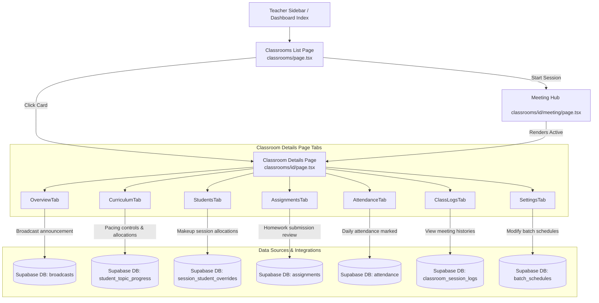

# KFA Website Application - Codebase Documentation

Welcome to the **Krishna Flute Academy (KFA) Website Application** developer documentation. This guide explains the technology stack, folder structure, code flows, and component architecture.

---

## ── Technology Stack ───────────────────────────────────────────────────────

1. **Framework**: Next.js (v16.1+) App Router
2. **Language**: TypeScript
3. **Database & Auth**: Supabase Client (authenticated via `@supabase/supabase-js`)
4. **Styling**: Tailwind CSS & custom Vanilla CSS config
5. **Hosting & Deployment**: Netlify (configured via `netlify.toml`)

---

## ── Folder-by-Folder Structure ───────────────────────────────────────────

Below is the directory map of the cleaned and organized repository:

```
KFA-Website-Application/
├── app/                      # Next.js App Router (pages and layouts)
│   ├── login/                # Authentication page
│   ├── student-dashboard/    # Student Portal dashboard page
│   └── teacher-dashboard/    # Teacher Portal dashboards
│       ├── classrooms/       # Classroom indexes & detail views
│       │   ├── [id]/         # Details page and active meeting hub
│       │   └── page.tsx      # Classroom list/calendar dashboard
│       └── page.tsx          # Teacher dashboard home page
├── src/                      # Shared frontend application code
│   ├── components/           # Component-oriented modular UI blocks
│   │   ├── classroom/        # Detail page tabs (Overview, Curriculum, etc.)
│   │   ├── student-dashboard/# Student dashboard subcomponents
│   │   ├── teacher-dashboard/# Teacher home page subcomponents
│   │   ├── TeacherHeader.tsx # Common header for teacher view
│   │   └── TeacherSidebar.tsx# Main navigation sidebar
│   └── lib/                  # Utilities, Supabase client, notifications
│       ├── notifications.ts  # Class notification broadcaster
│       └── supabase-auth.ts  # Supabase client instantiation & wrapper
├── database/                 # SQL schemas, backup, and db functions
├── scripts/                  # Code check-ups and database utilities
├── tests/                    # Database, student, and signup test scripts
├── public/                   # Static assets (images, icons, media players)
├── docs/                     # Developer docs & diagrams (THIS FOLDER)
├── tsconfig.json             # Root TypeScript compiler options
├── next.config.mjs           # Next.js bundler configurations
├── tailwind.config.js        # CSS styling theme overrides
└── package.json              # NPM package dependencies and scripts
```

---

## ── Navigation & Application Flow ───────────────────────────────────────

The application contains two distinct portals: the **Student Portal** and the **Teacher Portal**. The user workflow and routing paths are detailed below.

### 1. User Authentication Flow
- **Entry**: Users land at `/` or `/login`.
- **Role Verification**: After entering credentials, the login handler checks the user's role in the database.
- **Redirection**:
  - `role === 'student'` -> Redirects to `/student-dashboard`.
  - `role === 'teacher' || role === 'admin'` -> Redirects to `/teacher-dashboard`.

### 2. Teacher Portal Workflow
- **Overview**: Teachers land on the home dashboard (`/teacher-dashboard`), which shows statistics, announcements, and quick access links.
- **Classrooms Dashboard** (`/teacher-dashboard/classrooms`): Lists permanent weekly slots, today's active schedule, and temporary/makeup allocations.
- **Classroom details** (`/teacher-dashboard/classrooms/[id]`): Displays classroom detail stats, daily attendance, class logs, homework assignments, curriculum pacing, and slot settings.
- **Meeting Hub** (`/teacher-dashboard/classrooms/[id]/meeting`): Allows starting live online sessions or marking in-person attendance, utilizing video and duration timers.

### 3. Student Portal Workflow
- **Overview**: Students land on their home dashboard (`/student-dashboard`).
- **Activity**: Students can view progress metrics, look at unlocked syllabus topics, download practice sheets (PDFs) or listen to audio guides, upload practice videos, and submit homework assignments.

---

## ── Classrooms Module Architecture ────────────────────────────────────────

The detail page is component-oriented. Communication flows from the parent state manager down to the subcomponents via callbacks.



---

## ── Code Guidelines & Comments ───────────────────────────────────────────

- **Comment before you write**: Write clean comments explaining what the state propagation does.
- **Decoupled Components**: Keep subcomponents free of direct database writes unless specifically dealing with localized asynchronous actions. Always bubble up mutations to the parent layout whenever sync across multiple components is needed.
- **Type Safety**: Maintain exact typescript interfaces (like the `Student` interface) across modular components to avoid type-casting errors.
